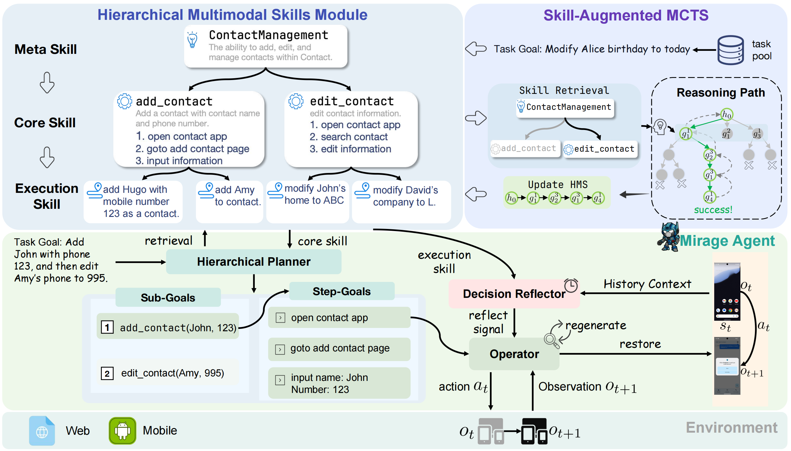
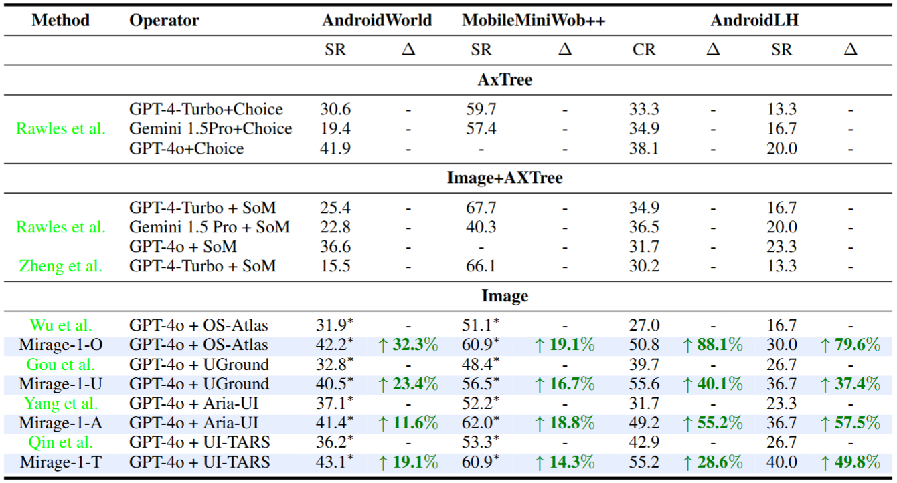

<div align="center">
<h2 align="center">
    <b>Mirage-1: Augmenting and Updating GUI Agent with 
     <br />  Hierarchical Multimodal Skills </b>b>
</h2>
<div>
<a target="_blank" href="https://scholar.google.com/citations?user=KO77A2oAAAAJ&hl=en">Yuquan&#160;Xie</a><sup>1</sup>,
<a target="_blank" href="https://scholar.google.com/citations?user=TDBF2UoAAAAJ&hl=en&oi=ao">Zaijing&#160;Li</a><sup>1 2</sup>,
<a target="_blank" href="https://scholar.google.com/citations?user=9Vc--XsAAAAJ&hl=en&oi=ao">Rui&#160;Shao</a><sup>1&#9993</sup>,
<a target="_blank" href="https://scholar.google.com/citations?user=Mpg0w3cAAAAJ&hl=en&oi=ao">Gongwei&#160;Chen</a><sup>1</sup>,
<br>
<a target="_blank" href="https://scholar.google.com/citations?hl=en&user=Awsue7sAAAAJ">Dongmei&#160;Jiang</a><sup>2</sup>,
<a target="_blank" href="https://scholar.google.com/citations?hl=en&user=nHmlZ5QAAAAJ">Kaiwen&#160;Zhou</a><sup>3</sup>,
  <a target="_blank" href="https://scholar.google.com/citations?user=M6YfuCTSaKsC&hl=en">Yinchuan&#160;Li</a><sup>3</sup>,
 <a target="_blank" href="https://scholar.google.com/citations?hl=en&user=yywVMhUAAAAJ">Liqiang&#160;Nie</a><sup>1&#9993</sup>
</div>
<sup>1</sup>Harbin Institute of Technology,Shenzhen&#160&#160&#160</span>
<sup>2</sup>Peng Cheng Laboratory&#160&#160&#160</span>
<sup>3</sup>Huawei Noah's Ark Lab</span>
<br />
<sup>&#9993&#160;</sup>Corresponding author&#160;&#160;</span>
<br/>
<div align="center">
    <a href="https://arxiv.org/abs/2506.10387" target="_blank">
    </a>
    <a href="https://cybertronagent.github.io/Mirage-1.github.io/" target="_blank">
    </a>
</div>
</div>

## :balloon: Framework
The Mirage-1 framework comprises a Hierarchical Planner, an Operator, a Decision Reflector, and a Hierarchical Multimodal Skills Module (HMS). To bridge the offline-online domain gap, Skill-Augmented Monte Carlo Tree Search (SA-MCTS) is employed for unseen task exploration, with successful trajectories expanding HMS capabilities. The Hierarchical Planner retrieves Core Skills from HMS and decomposes task goals into sub-goals for Operator execution. The Decision Reflector leverages Execution Skills to assess task execution feasibility.


## :smile_cat: Evaluation results

Table 1: Performance comparison on AndroidWorld, MobileMiniWob++, and AndroidLH.


## Conclusion
In this paper, we propose a Hierarchical Multimodal Skills module (HMS) that addresses the challenge of insufficient prior knowledge in long-horizon task planning. To address the domain gap between offline and online, a Skill-Augmented Monte Carlo Tree Search (SA-MCTS) algorithm is proposed. This algorithm effectively utilizes offline-acquired skills to reduce the action search space during online tree exploration. On top of HMS, we propose multimodal agent Mirage-1. Experimental results demonstrate that Mirage-1 achieves superior performance compared to SOTA GUI agents, particularly in long-horizon tasks.

## :hugs: Citation

If you find this work useful for your research, please kindly cite our paper:

```
@article{xie2025mirage,
  title={Mirage-1: Augmenting and Updating GUI Agent with Hierarchical Multimodal Skills},
  author={Xie, Yuquan and Li, Zaijing and Shao, Rui and Chen, Gongwei and Zhou, Kaiwen and Li, Yinchuan and Jiang, Dongmei and Nie, Liqiang},
  journal={arXiv preprint arXiv:2506.10387},
  year={2025}
}
```


